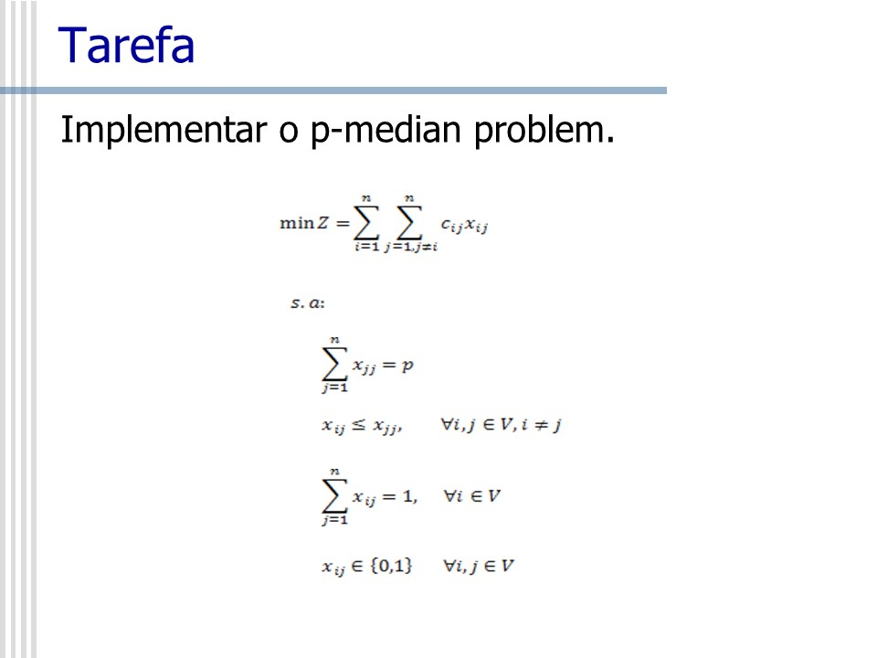

# p-mediana-with-Julia-and-CPLEX
Resolução do problema das p-medianas utilizando Julia e CPLEX

### Sobre o problema
A resolução se baseou na seguinte modelagem:  

### Resolução
A solução foi implementada utilizando Julia e CPLEX,  e consta no arquivo PROPOSICAO.jl.
